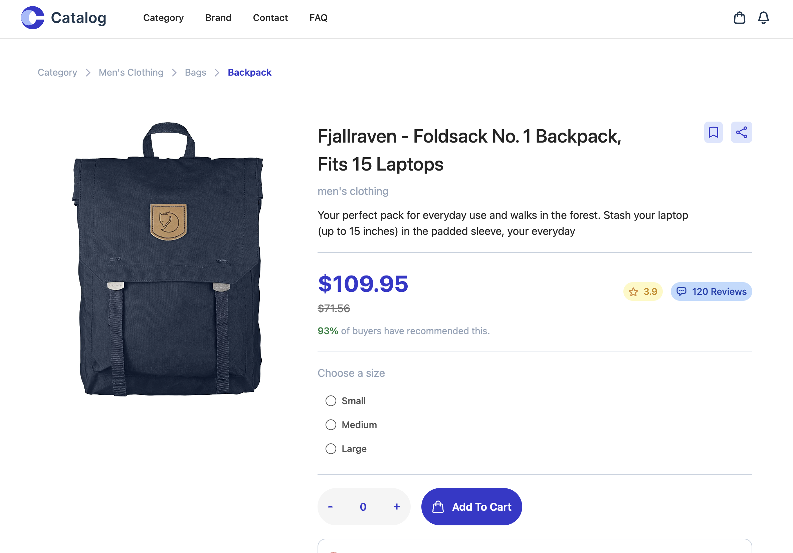

# Catalog

  <a href="#">About The Project</a>&nbsp;&nbsp;&nbsp;|&nbsp;&nbsp;&nbsp;
  <a href="#">Technologies</a>&nbsp;&nbsp;&nbsp;|&nbsp;&nbsp;&nbsp;
  <a href="#">Requirments</a>&nbsp;&nbsp;&nbsp;|&nbsp;&nbsp;&nbsp;
  <a href="#">Install</a>&nbsp;&nbsp;&nbsp;|&nbsp;&nbsp;&nbsp;
  <a href="#">Running the Project</a>

---

## 🚀 About the Project

Catalog is a product page which showcases details of a product for an ecommerce webiste. The data is fetched from an api.

---
## 💻 Technologies
- [React](https://react.dev/learn)
- [Tailwind Css](https://tailwindcss.com/docs/installation)
- [Vite](https://vitejs.dev/guide/)
- [VS Code](https://code.visualstudio.com) and [Prettier RC](https://github.com/prettier/prettier)

---
## 🧰 Requirements

For development, you will only need Node.js and a node global package installed in your environement.

### Node
- #### Node installation on Windows

  Just go on [official Node.js website](https://nodejs.org/) and download the installer.
  Also, be sure to have `git` available in your PATH, `npm` might need it (You can find git [here](https://git-scm.com/)).

- #### Node installation on Ubuntu

  You can install nodejs and npm easily with apt install, just run the following commands.

      $ sudo apt install nodejs
      $ sudo apt install npm

- #### Other Operating Systems
  You can find more information about the installation on the [official Node.js website](https://nodejs.org/) and the [official NPM website](https://npmjs.org/).

If the installation was successful, you should be able to run the following command.

    $ node --version
    v8.11.3

    $ npm --version
    6.1.0

### pnpm installation
After installing node, this project will need pnpm too, so run the following command to install pnpm globally.

      $ npm install -g pnpm

---

## ⚙️ Install
After installing pnpm run the following commands to clone the repo and install all the dependencies that is used for this application.

    $ git clone https://github.com/BrinsilElias/product-page.git
    $ cd product-page
    $ pnpm install

##  Running the project
After installing all the node modules run the below command to start the server. The server runs on port 5173 so after starting the server visit http://localhost:5173.

    $ pnpm start

## Resource Links

- [Webiste Link](https://main--astonishing-rolypoly-a776e2.netlify.app/)
- [Youtube Demo](https://www.youtube.com/watch?v=PaVyS2SrCiU)
- [Figma Design](https://www.figma.com/file/c0SsPEsPwXh3IFVB7COEVM/Product-Page?type=design&node-id=0%3A1&t=npzlXEQIBZ8PICfM-1)

---

